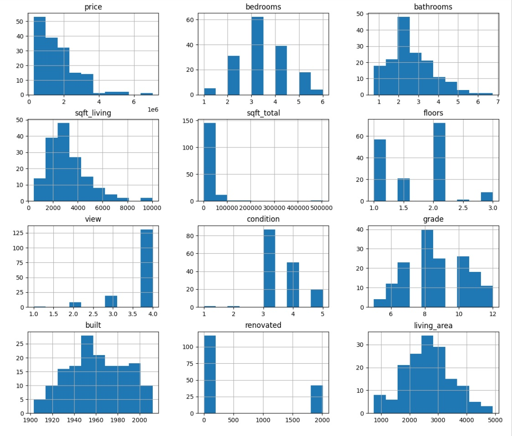
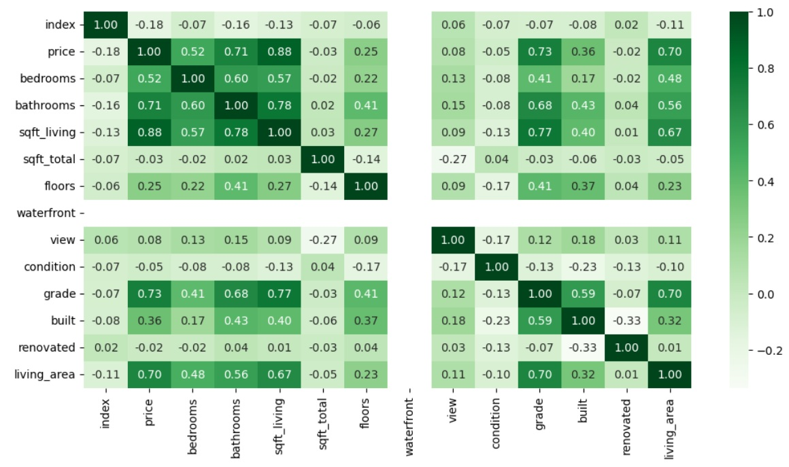
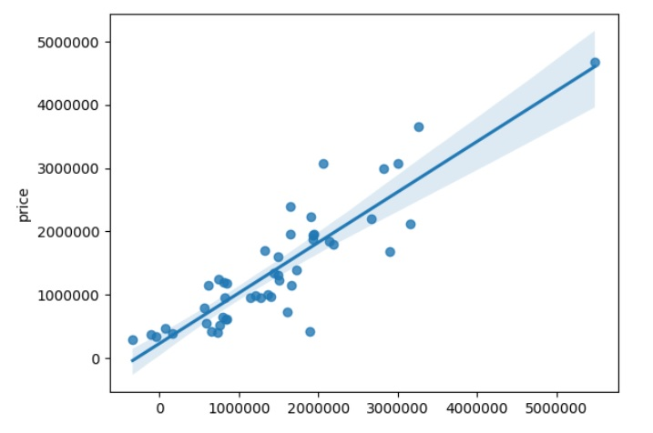

## Multiple Linear Regression Implementation on Manchester Properties Dataset

In this learning task Manchester properties data set was analyzed and a linear regression model implemented using scikit learn multiple linear regression model. Before implementing the regression, the exploratory data analysis performed to check the dataset for any potential issues. Then data preprocessing is performed by selecting the useful features and finally machine learning model was implemented. Below are the brief details of each step and for more details the jupyter notebook is enclosed “EDA_Manchester_All_Dataset.ipynb”.

## Exploratory Data Analysis
EDA covers the step for data inspection, column names correction, data types checking, handling of duplicate values, checking of missing values, checking the data spread using different methods like histogram.

## Linear Regression
The linear regression equation is ‘y=a+bx’ , where ‘y’ is the dependent variable, ‘x’ is the independent variable, ‘b’ is the slope, and ‘a’ is the y-intercept. It's used to model the linear relationship between two variables, with the slope indicating how much ‘y’ changes for a one-unit increase in ‘x’, and the y-intercept showing the value of ‘y’ when ‘x’ is zero. 
To implement the linear regression the feature selection is very crucial to obtain the good results. As per the above definition the selection of independent variables is important. Any biased and non-correlated feature will reduce the model performance

## Feature Selection 
To select the appropriate feature the correlation is one of the most useful techniques to select the features with high correlation. in this study the features selected with 0.5 correlation with the price variable.

## Implementing Multiple-Linear Regression
After selecting the highlight corelated features the MLR is implemented using sklearn Linear-Regression model. The model is trained by train dataset that is 70% split part of the total waterfront properties.  The model score appeared above 70% that is reasonably good, however it can be further improve by adding more data and features.  Below is the model performance metrics.

## Model Predicted values and actual values comparison
Below is the comparison for the model predicted and actual test values. The visualization is presenting the regression line. The model is considered as good if the lines are reasonably closers to the regression line.

